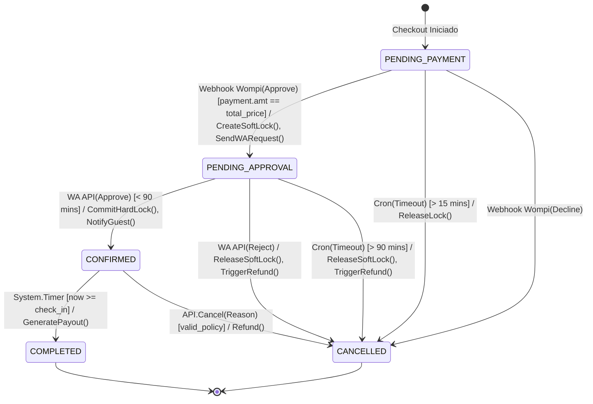
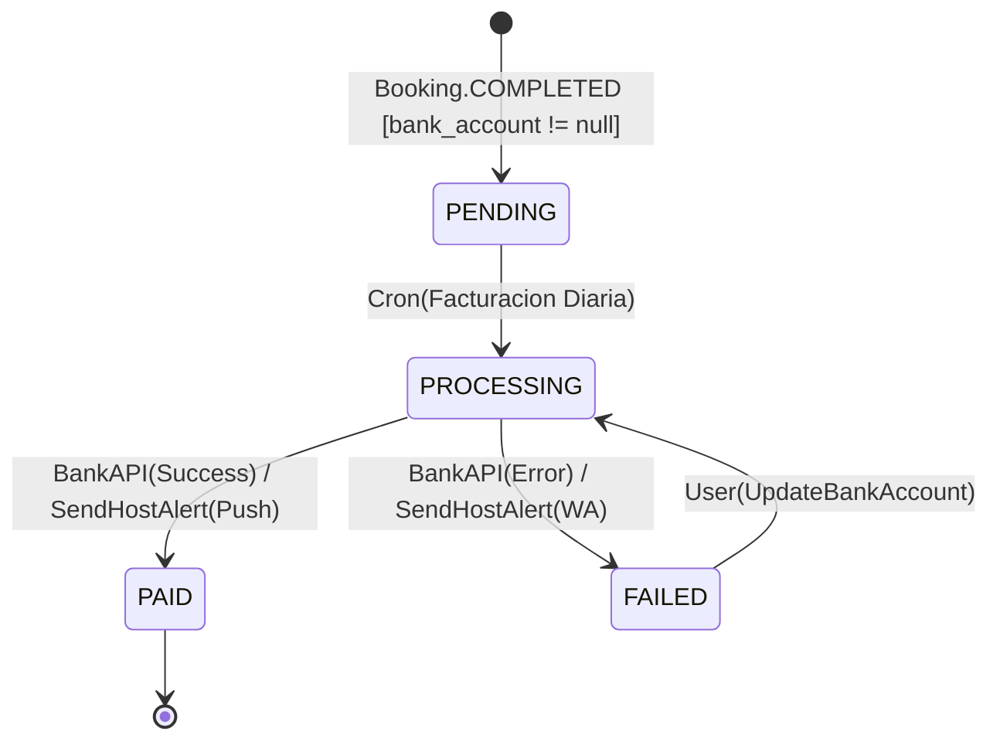
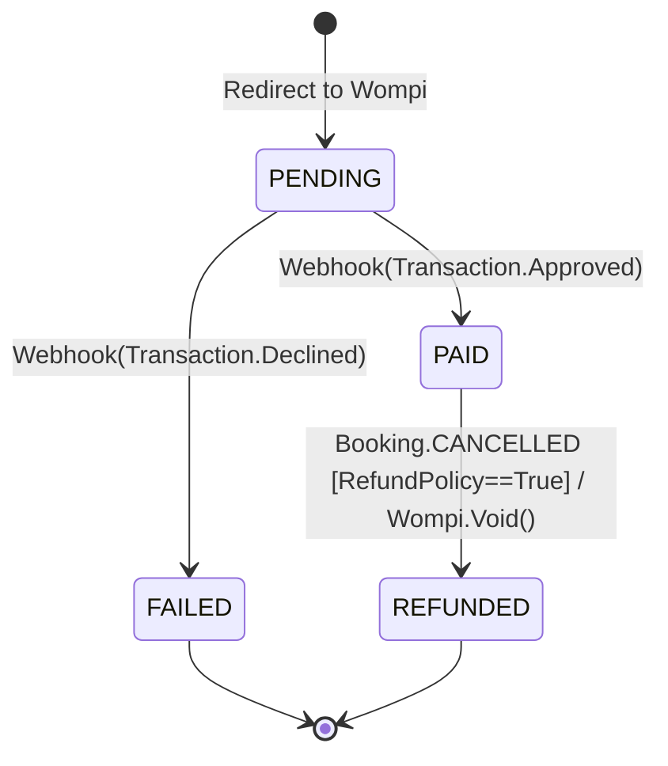
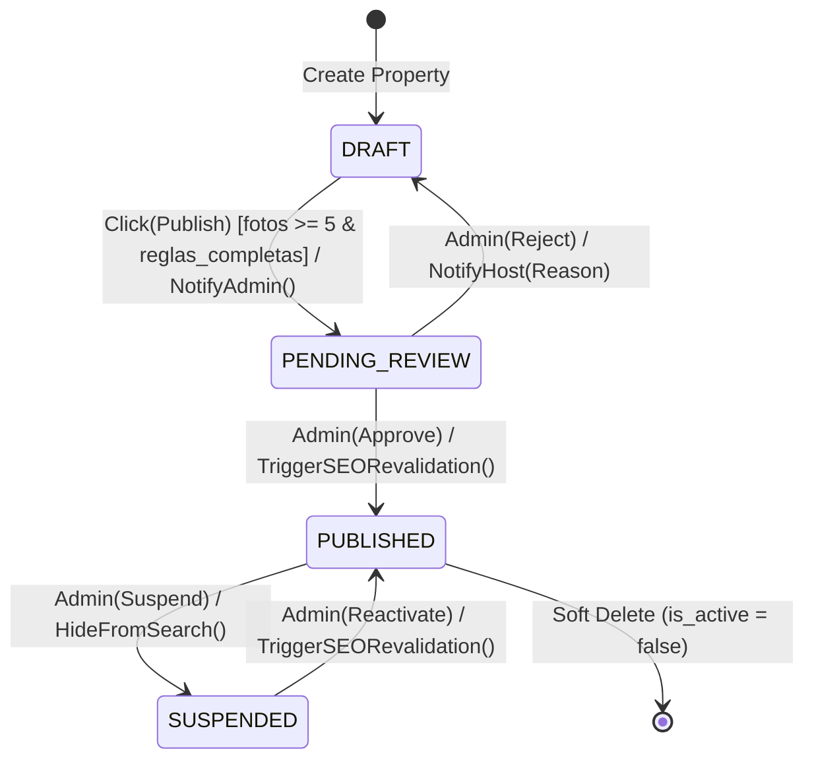

 # Entregable 8 (D8): State Machine Diagrams

**Proyecto:** Nos Fuimos de Finca
**Fase:** 4 Modelado del Sistema
**Alcance:** Global (Reservas, Propiedades, Pagos, Desembolsos)
**Estado:** Aprobado

---

## 1. Bookings (Reservas) State Machine

*Backlink a Fase 3:* Implementa las reglas de negocio estrictas de `[[PHASE_3_REQUIREMENTS_ENGINEERING/8.Business_Rules_and_Constraints.md]]` (especificamente la ventana de 15 min de pago y la ventana de 90 min de aprobacion B2B via WhatsApp).
*Construido a partir del ERD (D6).*

---

## 2. Payouts (Desembolsos) State Machine

Maquina de estado financiera que gestiona el envio de fondos (menos la comision de plataforma) a la cuenta bancaria del Finquero.

---

## 3. Payments (Pagos Entrantes) State Machine

Gestion del dinero que entra desde el turista via tarjeta de credito / PSE.

---

## 4. Properties (Inmuebles) State Machine

Ciclo de curaduria (KYC) antes de que una Finca pueda aparecer en el buscador publico.

---

## Implicacion de Fase
- **D9 (API Conceptual Design):** Los endpoints mutacionales (ej. `PATCH /bookings/approve`) deben validar los *Guards* aqui documentados antes de ejecutar el cambio.
- **D10 (Notification Matrix):** Las *Actions* de estas maquinas de estado (ej. `SendWARequest()`, `NotifyAdmin()`) se consolidaran en la matriz final de notificaciones.

