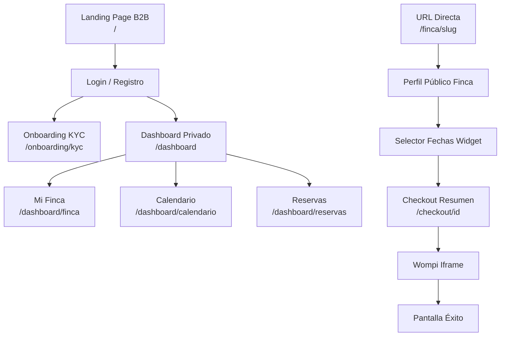

### Content Strategy & Information Architecture

**Project:** Nos Fuimos de Finca
**Phase:** 4 — System Modeling
**Deliverable:** 1 of 15
**Status:** Approved
**Date:** 2026-07-05
**Author:** Julián (Solo Engineer)

---

### 2. Content Taxonomy (Domain to View Mapping)

| Entidad (D3) | Necesidad del Actor | Tipo de Vista Resultante |
|---|---|---|
| **Finca** | `guest`: Ver detalles y precio. | Perfil Público (Shared Detail View) |
| **Finca** | `finquero`: Configurar datos. | Formulario de Gestión (Segregated Form) |
| **Calendario** | `guest`: Elegir fechas libres. | Widget (Nested en Perfil Público) |
| **Calendario** | `finquero`: Bloquear uso personal. | Full Calendar (Segregated View) |
| **Checkout/Reserva** | `guest`: Completar pago. | Flujo Wizard (Segregated View) |
| **Reserva/Pago** | `finquero`: Control de ingresos. | Lista/Dashboard (Segregated View) |
| **Finquero** | `finquero`: KYC Onboarding. | Formulario KYC (Segregated View) |

---

### 3. Hierarchical Sitemap (Mermaid)

*Nota Arquitectónica: Debido a la exclusión del Marketplace en el MVP (P1-D12), la navegación del Turista inicia de forma profunda en la URL de la finca, no en un buscador central.*

---

### 4. Navigation Mapping (RBAC)

| Nodo del Sitemap | Tipo de Vista | Rol Permitido | Reglas de UI / Redirecciones |
|---|---|---|---|
| `/` | Shared | Todos | Landing captación de Finqueros. Botón "Ingresar". |
| `/login` | Public | Todos | Si tiene sesión activa, redirige a `/dashboard`. |
| `/finca/[slug]` | Shared | Todos | Vista de lectura. Si el viewer = owner, muestra banner para editar. |
| `/checkout/[id]` | Segregated | `guest` | Requiere Soft-Lock ID válido. Sin menús globales para evitar fugas. |
| `/onboarding/kyc`| Segregated | `finquero` (pending)| Bloqueo de entrada si `kyc_status == approved`. |
| `/dashboard/*` | Segregated | `finquero` (approved)| Bloqueo de entrada si JWT inválido o KYC pendiente. Menú de navegación lateral presente. |
