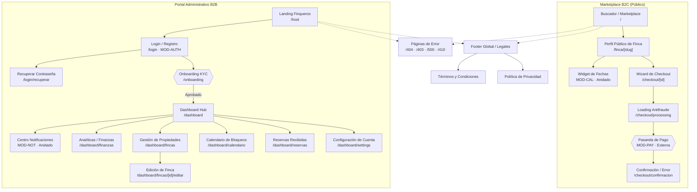

# Mapa de Navegación — Nos Fuimos de Finca

**Proyecto:** Nos Fuimos de Finca
**Fase:** 4 — Modelado del Sistema
**Entregable:** Mapa de Navegación
**Estado:** Aprobado

---

### 1. Inventario de Nodos de Navegación

El sistema se descompone en 24 nodos de navegación distribuidos en dos ecosistemas independientes (B2C y B2B) más un conjunto de nodos transversales. Trazabilidad: todos los nodos funcionales provienen del Domain Mapping de `[[1.Content_Strategy_Information_Architecture/Deliverable_1.md]]`. Los nodos auxiliares provienen de `[[PHASE_3_REQUIREMENTS_ENGINEERING/6.Non-Functional_Requirements]]`.

| Identificador de Ruta | Módulo Origen | Actor(es) Objetivo | Tipo de Nodo |
|:---|:---|:---|:---|
| `/` | `MOD-SRCH` | Todos (anónimo, `TOURIST`, `OWNER_API`) | [Top-Level] B2C |
| `/finca/[slug]` | `MOD-PROP` | Todos | [Secundaria] B2C |
| `/finca/[slug]::calendar` | `MOD-CAL` | `TOURIST` | [Anidada] en `/finca/[slug]` |
| `/checkout/[id]` | `MOD-RSV`, `MOD-PAY` | `TOURIST`, `AGENCY_USER` | [Oculta] |
| `/checkout/processing` | `MOD-PAY` | `TOURIST`, `AGENCY_USER` | [Oculta] |
| `/checkout/confirmacion` | `MOD-RSV` | `TOURIST`, `AGENCY_USER` | [Oculta] |
| `/host` | — (Marketing) | Todos | [Top-Level] B2B (público) |
| `/login` | `MOD-AUTH` | Anónimo, `TOURIST` | [Oculta] B2B |
| `/login/recuperar` | `MOD-AUTH` | Anónimo | [Oculta] B2B |
| `/onboarding` | `MOD-AUTH` | `OWNER_API` (pending KYC) | [Oculta] B2B |
| `/dashboard` | `MOD-DASH` | `OWNER_API`, `AGENCY_USER` | [Top-Level] B2B (protegido) |
| `/dashboard::notifications` | `MOD-NOT` | `OWNER_API`, `AGENCY_USER` | [Anidada] en `/dashboard` |
| `/dashboard/finanzas` | `MOD-DASH` | `OWNER_API`, `AGENCY_USER` | [Secundaria] B2B |
| `/dashboard/fincas` | `MOD-PROP` | `OWNER_API` | [Secundaria] B2B |
| `/dashboard/fincas/[id]/editar` | `MOD-PROP` | `OWNER_API` (dueño) | [Oculta] B2B |
| `/dashboard/calendario` | `MOD-CAL` | `OWNER_API` | [Secundaria] B2B |
| `/dashboard/reservas` | `MOD-RSV` | `OWNER_API`, `AGENCY_USER` | [Secundaria] B2B |
| `/dashboard/settings` | — (Settings) | `OWNER_API`, `AGENCY_USER` | [Secundaria] B2B |
| `/terminos-y-condiciones` | — (Legal) | Todos | [Oculta] Transversal |
| `/politica-de-privacidad` | — (Legal) | Todos | [Oculta] Transversal |
| `/404` | — (Error) | Todos | [Oculta] Transversal |
| `/403` | — (Error) | Todos | [Oculta] Transversal |
| `/500` | — (Error) | Todos | [Oculta] Transversal |
| `/410` | — (Error/Expiración) | Todos | [Oculta] Transversal |

---

### 2. Árbol Jerárquico de Navegación

Construido con: Ley de Pertenencia (un único padre lógico por nodo) + Ley de Flujo Causal (orden real de navegación del usuario). Referencia de proceso: `[[example_step_2_arbol_jerarquico.md]]`.

```
═══════════════════════════════════════════════
ECOSISTEMA B2C — MARKETPLACE PÚBLICO
═══════════════════════════════════════════════

- [Top-Level] Buscador / Marketplace (/)
    MOD-SRCH | Actor: Todos
  │
  └─ [Secundaria] Perfil Público de Finca (/finca/[slug])
      MOD-PROP | Actor: Todos
    │
    ├─ [Anidada] Widget de Fechas (::calendar)
    │   MOD-CAL | Actor: TOURIST
    │
    └─ [Oculta] Wizard de Checkout (/checkout/[id])
        MOD-RSV, MOD-PAY | Actor: TOURIST, AGENCY_USER
      │
      └─ [Oculta] Loading Antifraude (/checkout/processing)
          MOD-PAY | Actor: TOURIST, AGENCY_USER
        │
        └─ [Oculta] Confirmación / Error de Reserva (/checkout/confirmacion)
            MOD-RSV | Actor: TOURIST, AGENCY_USER


═══════════════════════════════════════════════
ECOSISTEMA B2B — PORTAL ADMINISTRATIVO
═══════════════════════════════════════════════

- [Top-Level] Landing Finqueros (/host)
    — (Marketing) | Actor: Todos
  │
  └─ [Oculta] Login / Registro (/login)
      MOD-AUTH | Actor: Anónimo, TOURIST
    │
    ├─ [Oculta] Recuperar Contraseña (/login/recuperar)
    │   MOD-AUTH | Actor: Anónimo
    │
    └─ [Oculta] Onboarding KYC (/onboarding)
        MOD-AUTH | Actor: OWNER_API (pending)
      │
      └─ [Top-Level protegido] Dashboard Hub (/dashboard)
          MOD-DASH | Actor: OWNER_API (KYC Ok), AGENCY_USER
        │
        ├─ [Anidada] Centro de Notificaciones (::notifications)
        │   MOD-NOT | Actor: OWNER_API, AGENCY_USER
        │
        ├─ [Secundaria] Analíticas y Finanzas (/dashboard/finanzas)
        │   MOD-DASH | Actor: OWNER_API, AGENCY_USER
        │
        ├─ [Secundaria] Gestión de Propiedades (/dashboard/fincas)
        │   MOD-PROP | Actor: OWNER_API
        │ │
        │ └─ [Oculta] Edición de Finca (/dashboard/fincas/[id]/editar)
        │     MOD-PROP | Actor: OWNER_API (dueño)
        │
        ├─ [Secundaria] Calendario de Bloqueos (/dashboard/calendario)
        │   MOD-CAL | Actor: OWNER_API
        │
        ├─ [Secundaria] Reservas Recibidas (/dashboard/reservas)
        │   MOD-RSV | Actor: OWNER_API, AGENCY_USER
        │
        └─ [Secundaria] Configuración de Cuenta (/dashboard/settings)
            — (Settings) | Actor: OWNER_API, AGENCY_USER


═══════════════════════════════════════════════
TRANSVERSALES (accesibles desde ambos ecosistemas)
═══════════════════════════════════════════════

- [Oculta Transversal] Términos y Condiciones (/terminos-y-condiciones)
- [Oculta Transversal] Política de Privacidad (/politica-de-privacidad)
- [Oculta Transversal] Páginas de Error: /404 | /403 | /500 | /410
```

---

### 3. Diagrama Visual del Mapa (Mermaid)

Referencia de proceso y semántica de flechas: `[[example_step_3_nav_diagram.md]]`.



---

### 4. Matriz RBAC de Routing (Reglas de Acceso por Ruta)

Referencia de proceso y justificaciones: `[[example_step_4_rbac_routing.md]]`. Las redirecciones documentadas aquí son conceptuales (HTTP 302): la implementación técnica exacta (middleware SSR, client-side guard, etc.) se decide en Fase 7 según la estrategia de renderizado adoptada.

| Ruta | Roles Permitidos | Estrategia UI | Comportamiento ante Rol/Estado Inválido |
|:---|:---|:---|:---|
| **`/`** | Todos | Shared View | Sin bloqueo. Header dinámico si hay JWT activo. |
| **`/finca/[slug]`** | Todos | Shared View | Si `OWNER_API` es dueño: inyectar barra "Vista Previa — [Ir a Editar]". |
| **`/checkout/[id]`** | `TOURIST`, `AGENCY_USER` + Soft-Lock válido | Segregated | Soft-Lock inválido o expirado → HTTP 302 `/finca/[slug]`. `OWNER_API` propietario → mensaje bloqueante. |
| **`/checkout/processing`** | `TOURIST`, `AGENCY_USER` (en flujo activo) | Segregated | Acceso directo → HTTP 302 `/`. Solo por redirección desde Checkout. |
| **`/checkout/confirmacion`** | `TOURIST`, `AGENCY_USER` (en flujo activo) | Segregated | Acceso directo → HTTP 302 `/`. Solo por redirección desde pasarela. |
| **`/host`** | Todos | Shared View | Sin bloqueo. |
| **`/login`** | Anónimo (sin sesión activa) | Segregated | JWT activo + `OWNER_API`/`AGENCY_USER` → HTTP 302 `/dashboard`. Previene loop de login. |
| **`/login/recuperar`** | Anónimo (sin sesión activa) | Segregated | JWT activo → HTTP 302 `/dashboard`. |
| **`/onboarding`** | `OWNER_API` (KYC: pending) | Segregated | KYC aprobado → HTTP 302 `/dashboard`. `TOURIST`/`guest` → HTTP 302 `/login`. `AGENCY_USER` → HTTP 302 `/dashboard`. |
| **`/dashboard`** | `OWNER_API` (KYC Ok), `AGENCY_USER` | Segregated | Sin JWT → HTTP 302 `/login`. JWT expirado → HTTP 302 `/login`. `TOURIST` → HTTP 302 `/`. KYC pendiente → HTTP 302 `/onboarding`. |
| **`/dashboard/finanzas`** | `OWNER_API` (KYC Ok), `AGENCY_USER` | Segregated | Hereda verificación en cadena del Dashboard Hub. |
| **`/dashboard/fincas`** | `OWNER_API` (KYC Ok) | Segregated | Hereda verificación del Hub. `AGENCY_USER` → HTTP 302 `/dashboard`. |
| **`/dashboard/fincas/[id]/editar`** | `OWNER_API` (KYC Ok, dueño de la finca) | Segregated | `OWNER_API` no dueño → HTTP 403. Hereda verificación del Hub. |
| **`/dashboard/calendario`** | `OWNER_API` (KYC Ok) | Segregated | Hereda verificación del Hub. `AGENCY_USER` → HTTP 302 `/dashboard`. |
| **`/dashboard/reservas`** | `OWNER_API` (KYC Ok), `AGENCY_USER` | Segregated | Hereda verificación en cadena del Hub. Vistas filtradas por portafolio. |
| **`/dashboard/settings`** | `OWNER_API` (KYC Ok), `AGENCY_USER` | Segregated | Hereda verificación en cadena del Hub. |
| **`/404`, `/403`, `/500`, `/410`** | Todos | Shared View | Acceso público obligatorio. Sin bloqueo. |
| **`/terminos-y-condiciones`** | Todos | Shared View | Acceso público obligatorio. Requisito regulatorio y de pasarela de pago. |
| **`/politica-de-privacidad`** | Todos | Shared View | Acceso público obligatorio. Requisito Habeas Data — Ley 1581. |
