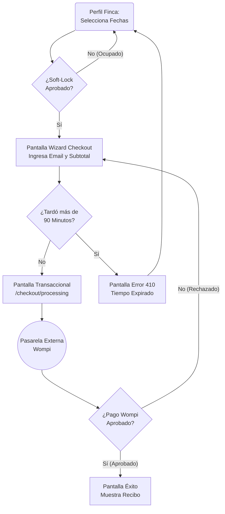
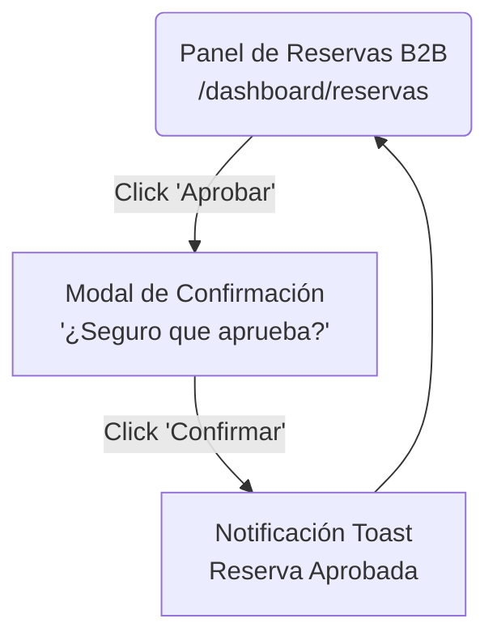

# User Flows: MOD-RSV (Reservas)

**Project:** Nos Fuimos de Finca
**Phase:** 4 — System Modeling (D2)
**Module:** MOD-RSV
**Status:** Approved

---

## 1. Flow Inventory

| Caso de Uso Origen (Fase 3) | Tipo de Flujo | Descripción UX | Actor Principal |
| :--- | :--- | :--- | :--- |
| **UC-RSV-01: Wizard de Checkout** | User Flow | Camino largo desde que elige fechas hasta que paga con Wompi o sufre un Timeout. | Turista |
| **UC-RSV-02: Aprobar Reserva B2B** | Task Flow | Acción rápida del Finquero al aceptar un huésped en su panel. | Finquero |

---

## 2. Screen Mapping & Flow Modeling

### 2.1. User Flow 1: El Camino Crítico del Checkout (Turista)
**Trigger:** Turista selecciona fechas disponibles en el Widget del Perfil de Finca e inicia el checkout.
**Pantallas (Nodos D1):** `/finca/[slug]` -> `/checkout/[id]` -> `/checkout/processing` -> `Wompi Gateway` -> `/checkout/success`.

### 2.2. Task Flow 1: Aprobación B2B (Finquero)
**Trigger:** El Finquero revisa su lista de reservas entrantes y decide aprobar a un grupo.
**Pantallas (Nodos D1):** `/dashboard/reservas`.

