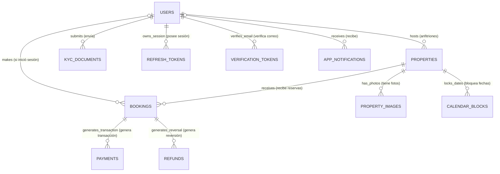
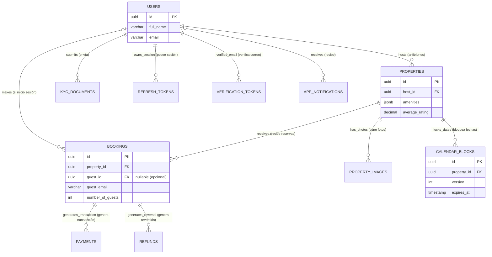

# Entregable 6 (D6): Modelo de Dominio y ERD Conceptual

**Proyecto:** Nos Fuimos de Finca
**Fase:** 4 — Modelado del Sistema
**Alcance:** Global
**Fecha:** 2026-07-09
**Estado:** Aprobado

---

### 1. Modelo Conceptual (Diagrama ER de Alto Nivel)

> [!TIP]
> **Guía de Lectura (Notación Crow's Foot de Mermaid)**
> Los diagramas inferiores utilizan la notación "Pata de Gallo" (Crow's Foot) que es el estándar de la industria para modelado relacional. Así se leen las conexiones:
> - `||--o{` : **Uno a Muchos** (Un elemento de la izquierda está relacionado con cero o muchos elementos de la derecha). *Ejemplo: Un Usuario (1) posee varias Propiedades (N).*
> - `|o--o{` : **Cero o Uno a Muchos** (Opcional en la izquierda, muchos a la derecha). *Ejemplo: Un Usuario (puede o no estar) hace varias Reservas (N).*
> - `||--||` : **Uno a Uno** (Un elemento de la izquierda se relaciona con exactamente un elemento de la derecha).

El modelo conceptual representa las entidades centrales de negocio y cómo se interrelacionan, abstrayéndose de detalles técnicos como tipos de datos o llaves primarias.

---

### 1.1 Modelo Lógico (ERD con Atributos y Claves)

El modelo lógico aterriza los conceptos a estructuras relacionales, definiendo tipos de datos e identificadores (`PK`, `FK`).

---

### 2. Diccionario de Datos Global (Restricciones de Base de Datos)

#### Tabla: `users` (Usuarios)
| Columna | Tipo de Dato | Restricciones |
|---|---|---|
| `id` | UUID | PK, NOT NULL |
| `full_name` | VARCHAR(150) | NOT NULL |
| `email` | VARCHAR(255) | UNIQUE, NOT NULL |
| `password_hash` | VARCHAR(255) | NOT NULL |
| `role` | VARCHAR(50) | NOT NULL, CHECK(role IN ('GUEST', 'HOST', 'AGENCY', 'ADMIN')) |
| `is_verified` | BOOLEAN | DEFAULT FALSE |
| `created_at` | TIMESTAMPZ | NOT NULL, DEFAULT NOW() |
| `updated_at` | TIMESTAMPZ | NOT NULL, DEFAULT NOW() |
| `deleted_at` | TIMESTAMPZ | NULL (Soft Delete) |

#### Tabla: `refresh_tokens` (Tokens de Refresco)
| Columna | Tipo de Dato | Restricciones |
|---|---|---|
| `id` | UUID | PK, NOT NULL |
| `user_id` | UUID | FK (users.id), NOT NULL |
| `token_hash`| VARCHAR(255) | UNIQUE, NOT NULL |
| `expires_at`| TIMESTAMPZ | NOT NULL |
| `is_revoked`| BOOLEAN | DEFAULT FALSE |
| `created_at` | TIMESTAMPZ | NOT NULL, DEFAULT NOW() |
| `updated_at` | TIMESTAMPZ | NOT NULL, DEFAULT NOW() |
| `deleted_at` | TIMESTAMPZ | NULL |

#### Tabla: `verification_tokens` (Tokens de Verificación)
| Columna | Tipo de Dato | Restricciones |
|---|---|---|
| `id` | UUID | PK, NOT NULL |
| `user_id` | UUID | FK (users.id), NOT NULL |
| `token` | VARCHAR(255) | UNIQUE, NOT NULL |
| `purpose` | VARCHAR(50) | NOT NULL, CHECK(purpose IN ('EMAIL_VERIFY', 'PASSWORD_RESET')) |
| `expires_at`| TIMESTAMPZ | NOT NULL |
| `created_at` | TIMESTAMPZ | NOT NULL, DEFAULT NOW() |
| `updated_at` | TIMESTAMPZ | NOT NULL, DEFAULT NOW() |
| `deleted_at` | TIMESTAMPZ | NULL |

#### Tabla: `kyc_documents` (Documentos KYC / RUT)
| Columna | Tipo de Dato | Restricciones |
|---|---|---|
| `id` | UUID | PK, NOT NULL |
| `user_id` | UUID | FK (users.id), NOT NULL |
| `s3_url` | VARCHAR(500) | NOT NULL |
| `status` | VARCHAR(50) | DEFAULT 'PENDING' |
| `created_at` | TIMESTAMPZ | NOT NULL, DEFAULT NOW() |
| `updated_at` | TIMESTAMPZ | NOT NULL, DEFAULT NOW() |
| `deleted_at` | TIMESTAMPZ | NULL |

#### Tabla: `properties` (Propiedades / Fincas)
| Columna | Tipo de Dato | Restricciones |
|---|---|---|
| `id` | UUID | PK, NOT NULL |
| `host_id` | UUID | FK (users.id), NOT NULL |
| `name` | VARCHAR(150) | NOT NULL |
| `slug` | VARCHAR(200) | UNIQUE, NOT NULL |
| `price_per_night` | DECIMAL(10,2) | NOT NULL, CHECK(>0) |
| `min_nights` | INT | NOT NULL, CHECK(>=1) |
| `max_guests` | INT | NOT NULL, CHECK(>=1) |
| `amenities` | JSONB | NOT NULL (Requiere GIN Index) |
| `average_rating` | DECIMAL(3,2) | DEFAULT 0.00 |
| `location` | POINT | NOT NULL (PostGIS) |
| `is_active` | BOOLEAN | DEFAULT TRUE |
| `created_at` | TIMESTAMPZ | NOT NULL, DEFAULT NOW() |
| `updated_at` | TIMESTAMPZ | NOT NULL, DEFAULT NOW() |
| `deleted_at` | TIMESTAMPZ | NULL |

#### Tabla: `property_images` (Imágenes de Propiedad)
| Columna | Tipo de Dato | Restricciones |
|---|---|---|
| `id` | UUID | PK, NOT NULL |
| `property_id` | UUID | FK (properties.id), NOT NULL |
| `url_hd` | VARCHAR(500) | NOT NULL |
| `url_gallery` | VARCHAR(500) | NOT NULL |
| `url_thumb` | VARCHAR(500) | NOT NULL |
| `created_at` | TIMESTAMPZ | NOT NULL, DEFAULT NOW() |
| `updated_at` | TIMESTAMPZ | NOT NULL, DEFAULT NOW() |
| `deleted_at` | TIMESTAMPZ | NULL |

#### Tabla: `bookings` (Reservas)
| Columna | Tipo de Dato | Restricciones |
|---|---|---|
| `id` | UUID | PK, NOT NULL |
| `property_id` | UUID | FK (properties.id), NOT NULL |
| `guest_id` | UUID | FK (users.id), NULL (Checkout Anónimo) |
| `guest_name` | VARCHAR(150) | NOT NULL |
| `guest_email` | VARCHAR(255) | NOT NULL |
| `guest_phone` | VARCHAR(50) | NOT NULL |
| `number_of_guests` | INT | NOT NULL, CHECK(>=1) |
| `check_in` | TIMESTAMPZ | NOT NULL |
| `check_out` | TIMESTAMPZ | NOT NULL |
| `total_price` | DECIMAL(10,2)| NOT NULL, CHECK(>0) |
| `platform_fee`| DECIMAL(10,2)| NOT NULL, CHECK(>=0) |
| `status` | VARCHAR(50) | DEFAULT 'PENDING_PAYMENT' |
| `created_at` | TIMESTAMPZ | NOT NULL, DEFAULT NOW() |
| `updated_at` | TIMESTAMPZ | NOT NULL, DEFAULT NOW() |
| `deleted_at` | TIMESTAMPZ | NULL |

#### Tabla: `calendar_blocks` (Bloqueos de Calendario)
| Columna | Tipo de Dato | Restricciones |
|---|---|---|
| `id` | UUID | PK, NOT NULL |
| `property_id` | UUID | FK (properties.id), NOT NULL |
| `start_date` | DATE | NOT NULL |
| `end_date` | DATE | NOT NULL |
| `status` | VARCHAR(50) | NOT NULL (SOFT_LOCK, HARD_LOCK, MANUAL) |
| `version` | INT | NOT NULL, DEFAULT 1 (Optimistic Lock) |
| `expires_at`| TIMESTAMPZ | NULL (Para CronJobs de expiración / TTL) |
| `created_at` | TIMESTAMPZ | NOT NULL, DEFAULT NOW() |
| `updated_at` | TIMESTAMPZ | NOT NULL, DEFAULT NOW() |
| `deleted_at` | TIMESTAMPZ | NULL |

#### Tabla: `payments` (Pagos)
| Columna | Tipo de Dato | Restricciones |
|---|---|---|
| `id` | UUID | PK, NOT NULL |
| `booking_id` | UUID | FK (bookings.id), NOT NULL |
| `wompi_tx_id`| VARCHAR(255) | UNIQUE, NOT NULL |
| `amount` | DECIMAL(10,2)| NOT NULL, CHECK(>0) |
| `service_fee`| DECIMAL(10,2)| NOT NULL, CHECK(>=0) |
| `created_at` | TIMESTAMPZ | NOT NULL, DEFAULT NOW() |
| `updated_at` | TIMESTAMPZ | NOT NULL, DEFAULT NOW() |
| `deleted_at` | TIMESTAMPZ | NULL |

#### Tabla: `refunds` (Reembolsos)
| Columna | Tipo de Dato | Restricciones |
|---|---|---|
| `id` | UUID | PK, NOT NULL |
| `booking_id` | UUID | FK (bookings.id), NOT NULL |
| `wompi_refund_id`| VARCHAR(255) | NULL (Generado asíncronamente) |
| `amount` | DECIMAL(10,2)| NOT NULL, CHECK(>0) |
| `status` | VARCHAR(50) | NOT NULL (PENDING, COMPLETED, FAILED) |
| `created_at` | TIMESTAMPZ | NOT NULL, DEFAULT NOW() |
| `updated_at` | TIMESTAMPZ | NOT NULL, DEFAULT NOW() |
| `deleted_at` | TIMESTAMPZ | NULL |

#### Tabla: `app_notifications` (Notificaciones de la Aplicación)
| Columna | Tipo de Dato | Restricciones |
|---|---|---|
| `id` | UUID | PK, NOT NULL |
| `user_id` | UUID | FK (users.id), NULL (Turista anónimo) |
| `guest_email` | VARCHAR(255) | NULL |
| `channel` | VARCHAR(50) | NOT NULL (EMAIL, WHATSAPP, SMS, IN_APP) |
| `status` | VARCHAR(50) | DEFAULT 'PENDING_QUEUE' |
| `is_read` | BOOLEAN | DEFAULT FALSE (Controla la campanita en la UI) |
| `created_at` | TIMESTAMPZ | NOT NULL, DEFAULT NOW() |
| `updated_at` | TIMESTAMPZ | NOT NULL, DEFAULT NOW() |
| `deleted_at` | TIMESTAMPZ | NULL |

---

### Implicación de Compuerta de Fase (Phase Gate Implication)
- Todas las relaciones han sido normalizadas, excepto aquellas explícitamente dictadas por requerimientos de rendimiento (Ej. JSONB Amenities en `CR-PROP-01`).
- Se han inyectado todas las columnas operativas dictadas por flujos ocultos (Tokens de Autenticación, Campos de Reembolso, Tiempos de Expiración en Calendarios y Variables Financieras).
- **Avanzar al D7:** Contratos de API (API Contracts).
