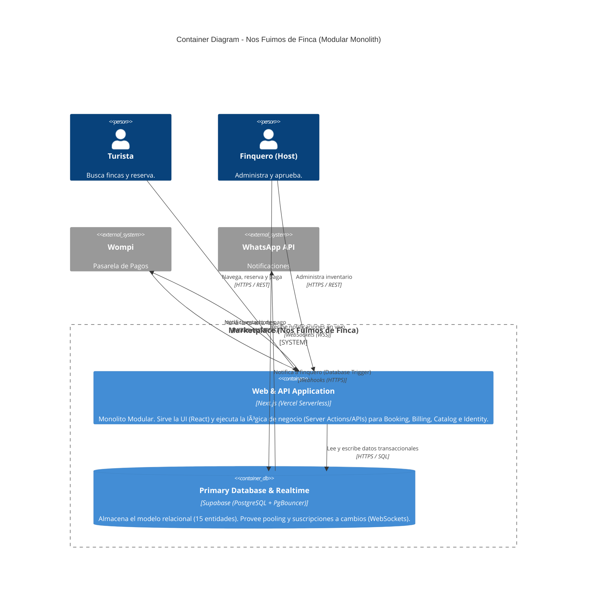

# Entregable 9 (D9): Component Diagram (C4 Model)

## 1. Metadata Header
**Proyecto:** Nos Fuimos de Finca
**Fase:** 5 — Architectural Design
**Estado:** Aprobado

*Backlink a Fase 5:* Este diagrama consolida y rinde cuentas exactas de las decisiones previas de infraestructura (`[[PHASE_5_ARCHITECTURAL_DESIGN/3.Deployment_Topology_Decision/example_output_d3_deployment_topology.md]]`), partición de código (`[[PHASE_5_ARCHITECTURAL_DESIGN/4.System_Decomposition_Decision/example_output_d4_system_decomposition.md]]`), y protocolos de red (`[[PHASE_5_ARCHITECTURAL_DESIGN/6.Communication_Pattern_Decision/example_output_d6_communication_pattern.md]]`).

---

## 2. Level 1: System Context Diagram

El Nivel 1 muestra a "Nos Fuimos de Finca" como una caja negra (System), rodeada de los usuarios (Turista, Finquero) y las plataformas externas críticas identificadas en la Fase 4.

```mermaid
C4Context
title System Context Diagram - Nos Fuimos de Finca

Person(turista, "Turista", "Busca fincas, realiza reservas y pagos.")
Person(host, "Finquero (Host)", "Publica fincas, aprueba reservas y recibe cobros.")

System(marketplace, "Nos Fuimos de Finca", "Plataforma central (Marketplace B2C/B2B) para alquiler de fincas de recreo.")

System_Ext(wompi, "Wompi (Bancolombia)", "Pasarela externa de pagos (Tarjetas, PSE).")
System_Ext(whatsapp, "WhatsApp Business API", "Sistema de mensajería para notificaciones push.")
System_Ext(supabase_auth, "Supabase Auth/Storage", "Proveedor externo de Identidad (JWT) y CDN de imágenes.")

Rel(turista, marketplace, "Busca y reserva fincas", "HTTPS")
Rel(host, marketplace, "Administra inventario y aprueba reservas", "HTTPS")

Rel(marketplace, wompi, "Inicia transacciones de cobro y dispersión", "API REST")
Rel(marketplace, whatsapp, "Envía notificaciones de reserva", "Webhooks / API")
Rel(marketplace, supabase_auth, "Autentica usuarios y lee/escribe fotos", "API REST")
```

---

## 3. Level 2: Container Diagram

El Nivel 2 hace zoom dentro de la caja "Marketplace" y revela las unidades de software desplegables reales (Containers). Aquí aplicamos estrictamente nuestra decisión de **Monolito Modular** (1 solo ejecutable web) y etiquetamos cada flecha de red con el protocolo exacto.

---

## 4. Consistency Notes
- **Verificación contra D4 (System Decomposition):** [OK]. Se muestra un solo contenedor ejecutable (`webapp`), honrando estrictamente la decisión de desarrollar un Monolito Modular y descartar microservicios.
- **Verificación contra D3 (Deployment Topology) & D6 (Communication):** [OK]. Los protocolos (`WebSockets/WSS`) y las capacidades avanzadas de la base de datos (Database Webhooks / `pg_net` para llamar a WhatsApp) encajan al 100% con la topología Supabase (BaaS) aprobada. No hay tecnologías inventadas en este diagrama.

---

## 5. Downstream Consumers
Este entregable es la fotografía oficial arquitectónica y es input obligatorio para:
- **D11 (Phase 5 RTM Update & Brief):** Al mapear requerimientos contra el código real, utilizaremos estos "Containers" como destino.
- **Phase 6 — D1 (Codebase & Folder Architecture):** La Fase 6 debe tomar el contenedor `webapp` y estructurarlo físicamente en un árbol de directorios de Next.js, respetando sus módulos internos.
- **Phase 7 — D3 (Walking Skeleton Implementation):** El primer hito de código real deberá trazar con éxito la ruta: `[UI Turista] -> [Next.js webapp] -> [Supabase database]`, comprobando que la comunicación entre contenedores funciona en la nube antes de programar las reglas de negocio.

