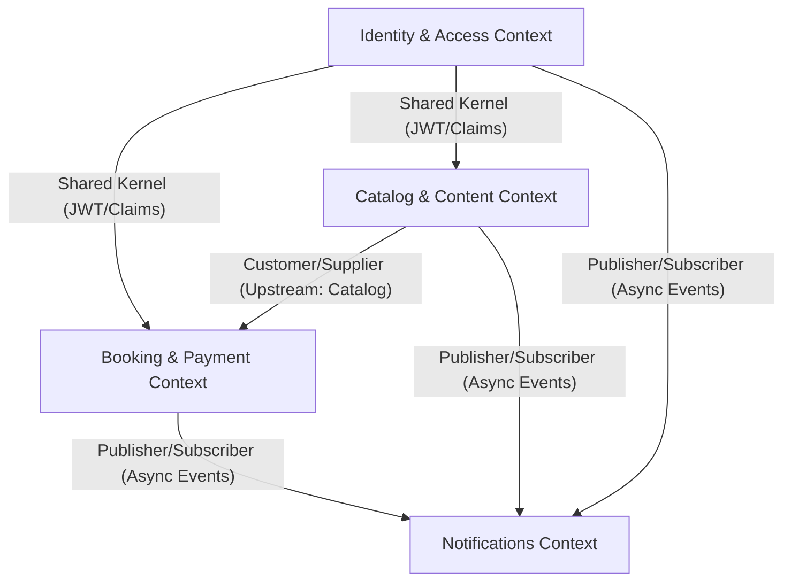

# Entregable 2 (D2): Formalización de Contexto Delimitado

**Proyecto:** Nos Fuimos de Finca
**Fase:** 5 — Diseño Arquitectónico
**Estado:** Aprobado

### 2. Definiciones de Contexto

| Contexto Delimitado | Clasificación | Responsabilidad | Entidades de Dominio Propias |
| --- | --- | --- | --- |
| **Booking & Payment** | Core | Gestión del ciclo de vida de la reserva, bloqueos de concurrencia (Soft-Lock/Hard-Lock) y conciliación financiera. | `Reserva`, `Pago` |
| **Catalog & Content** | Core | Descubrimiento de fincas, motor de búsqueda público y calificaciones post-viaje. | `Finca`, `Amenidad`, `Reseña` |
| **Identity & Access** | Generic | Autenticación, control de acceso (JWT) y perfiles de usuario. | `Usuario` |
| **Notifications** | Supporting | Envío de correos asíncronos y alertas del sistema. | N/A (Operacional) |

### 3. Diagrama de Mapa de Contexto

