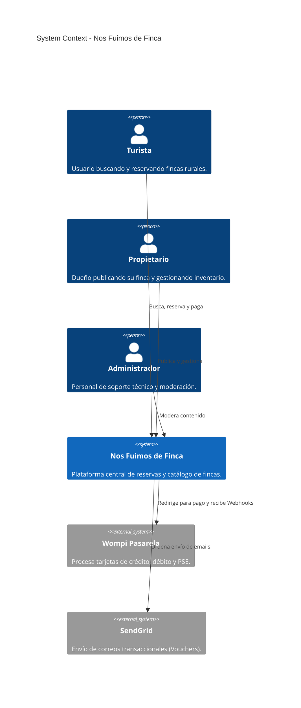
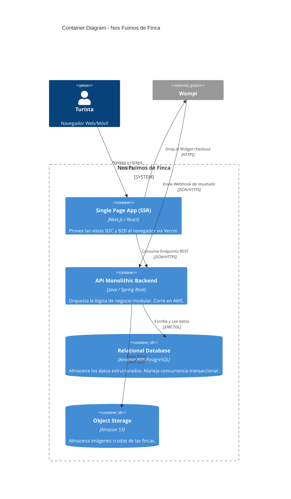

# Entregable 9 (D9): Diagrama de Componentes (Modelo C4)

**Proyecto:** Nos Fuimos de Finca
**Fase:** 5 — Diseño Arquitectónico
**Estado:** Aprobado

### 2. Nivel 1: Diagrama de Contexto del Sistema

### 3. Nivel 2: Diagrama de Contenedores

