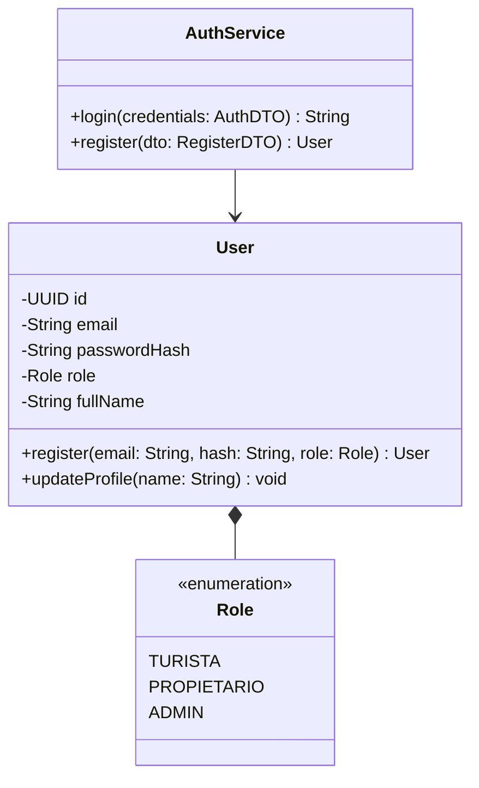

# Entregable 5 (D5): Diagramas de Clases y Entidades

**Proyecto:** Nos Fuimos de Finca
**Fase:** 6 — Diseño Técnico
**Módulo:** MOD-AUTH
**Estado:** Aprobado

## 2. Diagrama de Clases UML

```mermaid
classDiagram
    class User {
        -UUID id
        -String email
        -String passwordHash
        -Role role
        -String fullName
        +register(email: String, hash: String, role: Role) User
        +updateProfile(name: String) void
    }
    class Role {
        <<enumeration>>
        TURISTA
        PROPIETARIO
        ADMIN
    }
    class AuthService {
        +login(credentials: AuthDTO) String
        +register(dto: RegisterDTO) User
    }
    User *-- Role
    AuthService --> User
```
