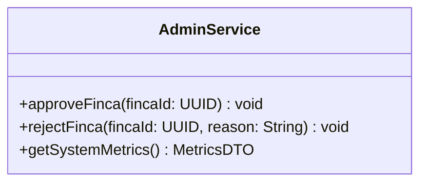

# Entregable 5 (D5): Diagramas de Clases y Entidades

**Proyecto:** Nos Fuimos de Finca
**Fase:** 6 — Diseño Técnico
**Módulo:** MOD-PADM
**Estado:** Aprobado

## 2. Diagrama de Clases UML
*(El panel de administración lee y aprueba entidades globales, no tiene entidades propias mas allá de los reportes)*

