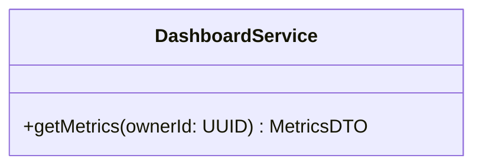

# Entregable 5 (D5): Diagramas de Clases y Entidades

**Proyecto:** Nos Fuimos de Finca
**Fase:** 6 — Diseño Técnico
**Módulo:** MOD-POWN
**Estado:** Aprobado

## 2. Diagrama de Clases UML
*(Dashboard no tiene entidades propias, lee de Fincas y Reservas)*

