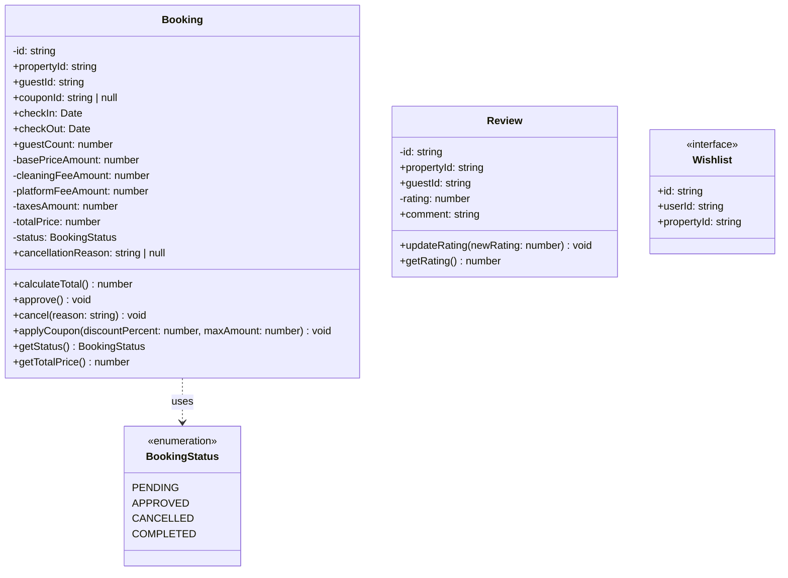

# Deliverable 5 (D5): Class & Entity Diagrams

## 1. Metadata Header
**Proyecto:** Nos Fuimos de Finca
**Fase:** 6 — Technical Design
**Modulo:** MOD-Booking
**Estado:** Approved

*Backlink a Fase 3 y 5:* Este entregable toma las entidades puras del ERD y les inyecta las Reglas de Negocio definidas en el `[[PHASE_3_REQUIREMENTS_ENGINEERING/7.Module_Specification.md]]`, logrando un Dominio Rico (Rich Domain Model) que sera codificado mediante clases de Java bajo los principios de *Clean Architecture* decididos en la Fase 5.

---

## 2. Diagrama de Clases UML (Java Abstraction)

> [!NOTE]
> Las propiedades marcadas con `-` son privadas y **no pueden ser alteradas directamente** desde controladores externos. Deben usarse los metodos publicos (`+`) provistos, garantizando que ninguna factura se emita con valores matematicos incorrectos y que no se viole la maquina de estados.

---

## 3. Justificacion Anti-Anemica

Para evitar el antipatron del *Modelo de Dominio Anemico* (donde la logica critica queda dispersa en multiples archivos tipo *Service*), la clase **Booking** concentra todas las validaciones financieras internamente:

1. **`calculateTotal()`:** Unifica matematicamente el valor en centavos (`basePriceAmount` + `cleaningFeeAmount` + `platformFeeAmount` + `taxesAmount`). Ningun programador podra calcular totales "a mano" en la UI o en un endpoint HTTP.
2. **`approve()` / `cancel()`:** Maquina de estados blindada. El metodo `cancel()` verificara internamente que el status actual sea `PENDING` o `APPROVED` y lanzara un error si se intenta cancelar una reserva `COMPLETED`. 
3. **`Wishlist` como Interfaz:** La lista de deseos es deliberadamente anemica (declarada como `<<interface>>`) porque, funcionalmente, es solo un Data Transfer Object (DTO) que une al usuario con una finca. No tiene reglas de validacion complejas, por lo tanto no requiere encapsulamiento.

---

## 4. Downstream Consumers
Este diseno es la semilla para el codigo real del Backend:
- **Phase 6 — D6 (Data Access & Repositories):** Los repositorios de PostgreSQL deberan devolver instancias reales (new Booking) en lugar de JSONs genericos, respetando este contrato.
- **Phase 7 — D5 (Backend API Implementation):** Los desarrolladores transcribiran este diagrama literal en archivos `.ts` (ej. `com.nosfuimosdefinica.booking/domain/Booking.ts`).

